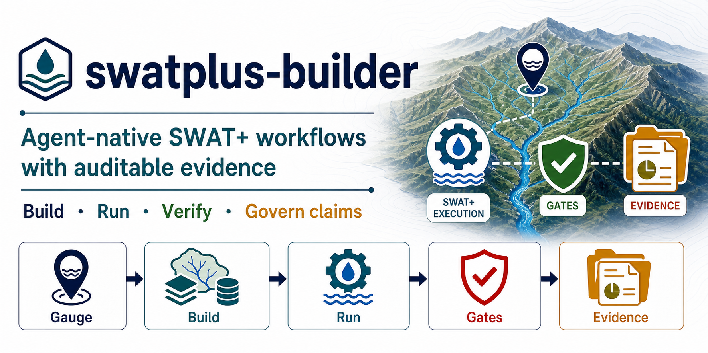

# swatplus-builder

[](https://pypi.org/project/swatplus-builder/)
[](https://pypi.org/project/swatplus-builder/)
[](LICENSE)
[](https://ai-hydro.github.io/swatplus-builder/)
[](https://doi.org/10.5281/zenodo.20650908)

<p align="center">
  
</p>

> **Calibrated SWAT+ models from a single gauge ID — with evidence you can audit.**

`swatplus-builder` builds and calibrates SWAT+ hydrologic models in Python,
starting from one USGS streamgage ID. It can be driven by a person or by an AI
agent — and either way, the **software, not the operator, decides what each
result is allowed to claim**, through runtime gates, provenance, locked reruns,
and evidence-backed claim tiers.

The whole pipeline runs in Python with **no desktop GIS** — no QGIS, PyQGIS, or
the QSWATPlus plugin. GIS work uses WhiteboxTools + rasterio + geopandas, and
the SQLite → `TxtInOut` translation uses the vendored
[SWAT+ Editor Python API](https://github.com/swat-model/swatplus-editor).

> **📚 Full documentation: <https://ai-hydro.github.io/swatplus-builder/>**
> Concepts (claim governance, locked calibration, the evidence bundle), a user
> guide, the agent/MCP surface, and a CLI/Python/schema reference.
>
> **New here? Read [`QUICKSTART.md`](QUICKSTART.md).** It covers requirements,
> install, engine/reference-DB bootstrap, the canonical one-command workflow,
> and how to operate the pipeline through an AI agent (MCP).

The canonical end-to-end path is a single command:

```bash
swat workflow run --usgs-id <id> --model-family full \
  --start 2000-01-01 --end 2019-12-31 --warmup-years 3 \
  --calibrate --claim-tier research_grade --json
```

It builds the model, runs the engine, locks a benchmark, runs gated diagnostic
calibration, independently verifies a locked rerun, and writes a machine-readable
**evidence bundle** with explicit allowed/blocked claims. The package — not the
agent — decides what may be claimed.

---

## Status

**Alpha, v0.4.0** — locked-benchmark calibration, 11-tool agent (MCP) surface, container baseline.

- [x] Pure-Python GIS (WhiteboxTools, rasterio, geopandas)
- [x] Automated SWAT+ project generation
- [x] Weather (GridMET / synthetic)
- [x] USGS NWIS observed discharge fetch
- [x] Two-pass outlet evaluation (auto-select → strict-pin)
- [x] NSE / KGE / BFI metrics (`evaluate_run` — authoritative)
- [x] **Locked-benchmark calibration protocol** (lock → calibrate → verify)
- [x] pySWATPlus bridge with fail-loud diagnostics artifact
- [x] 11-tool MCP server (`swat mcp` / docker-compose mcp service)
- [x] Container baseline (Dockerfile + docker-compose)
- [x] Publication-ready figures (7+ types)

See:

- **[Documentation site](https://ai-hydro.github.io/swatplus-builder/)** — concepts, user guide, agent/MCP, and full reference
- [`QUICKSTART.md`](QUICKSTART.md) — install, run, and operate via agents
- [Honest status](https://ai-hydro.github.io/swatplus-builder/project/status/) — what the system actually claims today (0/11 research-grade)
- [`ROADMAP.md`](ROADMAP.md) — phased plan with checkboxes
- [`PROGRESS.md`](PROGRESS.md) — running progress journal
- [`DECISIONS.md`](DECISIONS.md) — architecture decision records
- [`docs/AGENT_WORKFLOW.md`](docs/AGENT_WORKFLOW.md) — implemented negotiate → run → evidence flow
- [`docs/ARCHITECTURE.md`](docs/ARCHITECTURE.md) — system architecture

---

## Authoritative calibration path

The **lock → calibrate → verify** chain is the only scientifically defensible route to reported calibration metrics.

```
1. swat lock-benchmark     # snapshot baseline metrics + alignment CSV
       ↓
2. swat locked-calibrate   # real-engine DDS on CN2 + ALPHA_BF only
       ↓                   # (calls verify automatically unless --skip-verify)
3. metrics reported        # delta NSE/KGE vs locked baseline, independently verified
```

**Rules** (enforced by the toolchain):
- Parameters are restricted to `CN2` and `ALPHA_BF` — no silent scope expansion.
- Calibrated metrics are always delta-reported against the locked baseline.
- `verify_calibration` is mandatory — it re-runs the best solution independently to confirm reproducibility.
- `evaluate_run` is the authoritative metric source for all reporting.

One-liner for agents:
```bash
swat locked-calibrate \
  --benchmark-dir artifacts/locks/usgs_01547700/benchmark \
  --base-txtinout TxtInOut/ \
  --out-dir artifacts/calibration/ \
  --json
```

### Bridge diagnostics (non-authoritative / fail-loud)

The **pySWATPlus bridge** (`swat calibrate --calibration-engine pyswatplus`) is a secondary calibration path. When it fails, it writes a structured `bridge_failure_diagnostic.json` artifact (timestamp, traceback, staged file manifest, failure stage) and exits non-zero. Do not rely on raw bridge objective values for reporting — the bridge metric parity layer redirects all reported metrics through `evaluate_run`.

**If the bridge path fails:** check `bridge_failure_diagnostic.json` under the calibration artifacts directory. The real-engine path (`swat calibrate --real-engine` or `swat locked-calibrate`) is the currently reliable authoritative route.

---

## Install

```bash
# Core only
pip install swatplus-builder

# With GIS stack (recommended)
pip install "swatplus-builder[gis]"

# With HyRiver helpers (USGS gauges, NHDPlus, py3dep, GridMET)
pip install "swatplus-builder[gis,hyriver]"

# Full dev environment
pip install -e ".[all]"
```

SWAT+ engine binary is **not** a pip dependency — bring your own `swatplus_exe` and mount it at runtime.

---

## Container quick-start

```bash
# Build image
docker compose build

# Check runtime health (no binary mounted — expect degraded)
docker compose run --rm swat health --json

# Run with binary mounted
SWATPLUS_BIN_DIR=/path/to/swatplus_dir docker compose run --rm swat version
SWATPLUS_BIN_DIR=/path/to/swatplus_dir docker compose run --rm swat health

# Run locked-calibrate inside container (artifacts persisted to ./artifacts/)
SWATPLUS_BIN_DIR=/path/to/swatplus_dir docker compose run --rm swat \
  locked-calibrate \
  --benchmark-dir /data/artifacts/locks/usgs_01547700/benchmark \
  --base-txtinout /data/TxtInOut \
  --out-dir /data/artifacts/calibration \
  --json

# MCP stdio server (for agent connections)
SWATPLUS_BIN_DIR=/path/to/swatplus_dir docker compose run --rm mcp
```

Volume mounts (configured in `docker-compose.yml`):
- `./artifacts` → `/data/artifacts` (persisted run/calibration artifacts)
- `$SWATPLUS_BIN_DIR` → `/opt/swatplus` (SWAT+ engine binary directory, read-only)
- `$SWATPLUS_DATASETS_DIR` → `/data` (reference datasets SQLite)

---

## CLI (`swat`)

```bash
# Version with git SHA
swat version
swat version --json   # machine-readable

# Runtime health check (deterministic exit codes: 0=healthy, 1=degraded, 2=unhealthy)
swat health
swat health --json

# Full pipeline (one-liner for existing TxtInOut)
swat run --txtinout TxtInOut/ --threads 4

# Locked-benchmark protocol
swat lock-benchmark \
  --txtinout TxtInOut/ \
  --observed-csv observed.csv \
  --out-dir artifacts/locks/my_basin \
  --basin-id usgs_01547700

swat locked-calibrate \
  --benchmark-dir artifacts/locks/my_basin/benchmark \
  --base-txtinout TxtInOut/ \
  --out-dir artifacts/calibration/my_basin \
  --parameters CN2,ALPHA_BF \
  --json

# Multi-basin readiness table
swat readiness-table --locks-root artifacts/locks/ --json

# Inspect persisted run metadata
swat inspect <run_path>

# Benchmark validation over a basin suite
swat validate --basins basins/curated_v1.json

# Launch MCP server (stdio)
swat mcp
```

### Exit-code contract

| Code | Meaning |
|------|---------|
| 0 | Success |
| 1 | Runtime / engine failure (external tool failed, bridge error) |
| 2 | User / config error (bad arguments, missing required files, unknown parameters) |
| 3 | Quality gate failure (e.g., `--min-improvement-nse` not met) |

---

## MCP server — 11-tool surface

```bash
pip install "swatplus-builder[mcp]"
swat mcp   # stdio transport
```

MCP client config (Claude Desktop / Cursor / any MCP host):

```json
{
  "mcpServers": {
    "swatplus-builder": {
      "command": "swat",
      "args": ["mcp"],
      "env": {
        "SWATPLUS_EXE": "/usr/local/bin/swatplus_exe",
        "SWATPLUS_BUILDER_ARTIFACTS": "/data/artifacts"
      }
    }
  }
}
```

Tool tiers:

**Tier 1 — Basin workflow** (8 tools): `build_project`, `run_basin`, `calibrate`, `propose_parameters`, `compare_runs`, `query_artifacts`, `diagnose_failure`, `validate`

**Tier 2 — Benchmark / readiness** (3 tools): `lock_benchmark`, `locked_calibrate`, `readiness_table`

### Teaching an agent the system

[`SKILL.md`](SKILL.md) at the repo root is a self-contained agent skill file —
when to use the system, the 11-tool catalog with signatures, the parameter
registry, diagnostic heuristics, basin taxonomy, the locked-benchmark rules,
and worked workflows. For Claude Code (and any skill-aware agent), point the
agent at `SKILL.md` to bring it up to competence before it touches a tool.

---

## Soil fidelity flags

Every run persists soil realism metadata in `metadata.json`:

- `soil_mode`: `high_fidelity` | `fallback` | `synthetic`
- `pct_fallback_soils`: fraction of basin polygons using fallback soil profiles

Fallback usage >25% emits a warning. Threshold configurable via `SWATPLUS_SOIL_FALLBACK_WARN_THRESHOLD`. Generated figures include a visible quality annotation for fallback/synthetic runs.

Use `swat inspect <run_path>` to view persisted metadata.

---

## Agent-facing API

```python
from swatplus_builder.tools import (
    build_watershed,
    create_hrus,
    generate_swat_project,
    run_swat,
)

ws = build_watershed(
    dem_path="data/dem.tif",
    outlet=(-77.123, 41.456),
    stream_threshold_cells=500,
    workdir="runs/marsh_creek/",
)

hrus = create_hrus(ws, "data/nlcd_2019.tif", "data/gnatsgo_mukey.tif")
project = generate_swat_project(ws, hrus, "data/weather/", "2000-01-01", "2010-12-31", "marsh_creek_v1")
result = run_swat(project, threads=4)
```

Locked-benchmark API (for direct Python use):

```python
from swatplus_builder.calibration.locked_benchmark import (
    lock_benchmark,
    calibrate_against_lock,
    verify_calibration,
    build_readiness_table,
)

lock = lock_benchmark(txtinout_dir, obs_series, out_dir, basin_id="usgs_01547700", outlet_gis_id=1)
evidence = calibrate_against_lock(lock, base_txtinout, out_dir, parameters=["CN2", "ALPHA_BF"])
result = verify_calibration(lock, evidence.best_solution_json, base_txtinout, out_dir)
rows = build_readiness_table(locks_root)
```

---

## Phase 3E calibration evidence baseline

As of 2026-04-25, the locked real-engine calibration protocol has been run and independently verified on two USGS basins (CN2 + ALPHA_BF only, real-engine DDS):

| Basin | Baseline NSE | Calibrated NSE | ΔNSE | Baseline KGE | Calibrated KGE | ΔKGE | Status |
|-------|-------------|----------------|------|-------------|----------------|------|--------|
| `usgs_01547700` | 0.1256 | **0.2107** | +0.085 | 0.036 | **0.116** | +0.080 | PASS |
| `usgs_03339000` | 0.0618 | **0.3192** | +0.257 | -0.097 | **0.187** | +0.284 | PASS |

Both basins: independently verified (re-run of best solution, not calibration-loop metrics). Evidence bundle: `tests/_artifacts/phase3e_readiness/real_engine_bundle_20260425/`.

> **Note:** the current canonical path is `swat workflow run` (see
> [`QUICKSTART.md`](QUICKSTART.md)); the `lock-benchmark` / `locked-calibrate`
> commands above remain valid lower-level primitives. For the current honest
> validation status across the basin suite, see
> [`docs/PIPELINE_RESEARCH_GRADE_AUDIT.md`](docs/PIPELINE_RESEARCH_GRADE_AUDIT.md).

**Honest caveats:** NSE < 0.5 for both basins — improvement is real and verified but absolute skill is not yet benchmark-grade. Physical realism work (soil conductivity, routing) is needed before positive-skill claims. pySWATPlus bridge is non-authoritative until bridge stability is proven.

---

## What this package does NOT do

- **No QGIS.** If you need byte-for-byte QSWATPlus parity, use QSWATPlus. We aim for numerical agreement within a few percent.
- **No pySWATPlus replacement.** pySWATPlus edits an existing `TxtInOut` and runs calibrations. swatplus-builder builds the `TxtInOut`. They are complementary.
- **No SWAT+ engine bundled.** Bring your own `swatplus_exe` and mount it at runtime.

---

## Citation

If you use swatplus-builder in your research, please cite:

```bibtex
@software{galib_swatplus_builder_2026,
  author       = {Galib, Mohammad and Merwade, Venkatesh},
  title        = {{swatplus-builder: Claim-governed SWAT+ hydrologic
                   modeling from a USGS gauge ID}},
  year         = {2026},
  publisher    = {Zenodo},
  version      = {0.4.0},
  doi          = {10.5281/zenodo.20650908},
  url          = {https://doi.org/10.5281/zenodo.20650908}
}
```

When reporting a specific result, also cite the run's provenance hash from
`evidence_summary.json` — a metric without its run provenance is not
reproducible. See [Citing & references](https://ai-hydro.github.io/swatplus-builder/project/citing/).

---

## License

MIT. See [LICENSE](LICENSE).

Vendored: [`swat-model/swatplus-editor`](https://github.com/swat-model/swatplus-editor) (Apache-2.0). Reference databases downloaded at install time from the `ai-hydro/swatplus-reference-data` mirror. pySWATPlus is GPL-3.0 and is an optional dependency — see `DECISIONS.md` for the licensing posture.
